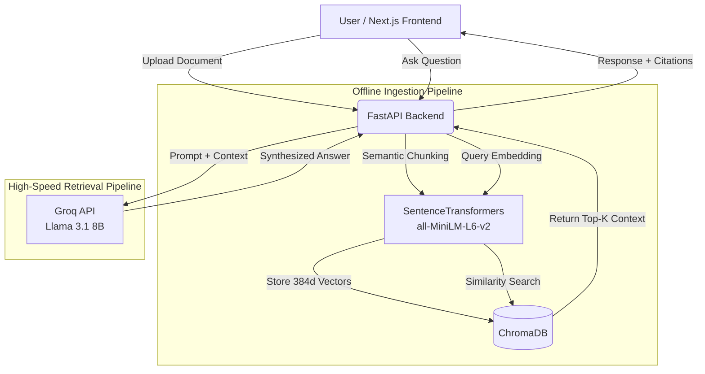

# 🧠 RAG Intelligence System

> **Enterprise-Grade Knowledge Retrieval Engine**
> A multi-document AI ecosystem engineered to parse complex documents, evaluate context matching metrics, and deliver deterministic answers paired with granular source citations—at zero API embedding cost.


---

## 🔥 Key Capabilities

* **Hybrid Ingestion Pipeline** — Native processing primitives for complex PDFs and document frameworks.
* **Zero-Cost Local Vectorization** — Utilizes `all-MiniLM-L6-v2` to vectorize documents entirely on-device, ensuring absolute data privacy and zero API overhead.
* **Deterministic Citations** — Maps generative model assertions directly back to source document chunks with exact cross-referencing (Document Name + Page Number).
* **Confidence Scoring Engine** — Semantic evaluation architecture providing an instant metric response layout (High | Medium | Low) based on Euclidean/Cosine distance.
* **Comparative Workspace** — Dual-pane execution analysis synthesizing contrasting information from two distinct data sources against a uniform query block.

---

## 🏗 Architectural Blueprint

The system is designed for maximum privacy and high-speed inference. It offloads heavy semantic chunking to a local CPU-optimized embedding model while leveraging Groq's specialized LPU silicon for near-instant text generation.



---

## 💻 Core Stack Matrix

| Layer                | Technologies                                  |
| -------------------- | --------------------------------------------- |
| **Backend Engine**   | `Python` · `FastAPI` · `Uvicorn`              |
| **Vector Index**     | `ChromaDB` · `Sentence-Transformers (MiniLM)` |
| **LLM Inference**    | `Groq Cloud API` · `Llama 3.1 (8B)`           |
| **Client Interface** | `Next.js 14` · `TypeScript` · `Tailwind CSS`  |
| **Configuration**    | `Pydantic V2` · Strict Environment Validation |

---

## 🚀 Environment Bootstrap (Local Setup)

### Prerequisites

* Python 3.11+
* Node.js 18+
* A free Groq API Key

### 1. Backend Initialization

```bash
cd backend
python -m venv .venv
.\.venv\Scripts\activate

# Mac/Linux
source .venv/bin/activate

pip install -r requirements.txt
```

Create a `.env` file inside the `backend` directory:

```env
CHROMA_PERSIST_DIRECTORY=./chroma_db
EMBEDDING_MODEL=all-MiniLM-L6-v2
LLM_MODEL=llama-3.1-8b-instant
CHUNK_SIZE=1000
CHUNK_OVERLAP=200
TOP_K_RESULTS=5
GROQ_API_KEY=your_groq_key_here
```

Start the backend:

```bash
python -m uvicorn app.main:app --reload
```

### 2. Frontend Initialization

Open a second terminal:

```bash
cd frontend
npm install
npm run dev
```

Access the application at:

```text
http://localhost:3000
```

---

## 🔬 How the Confidence Meter Works

To reduce hallucinations and increase answer reliability, the system calculates a contextual confidence score before generating a response.

When a user submits a question, the local embedding model converts that question into a 384-dimensional vector. ChromaDB then measures how semantically close the question is to stored document chunks.

The backend applies a simple inversion formula:

```text
Confidence = 1 - Distance
```

This is transformed into a user-friendly confidence percentage.

### Confidence Levels

| Score         | Meaning                                                                           |
| ------------- | --------------------------------------------------------------------------------- |
| **80%+**      | High Confidence — Retrieved content strongly matches the question.                |
| **60–79%**    | Medium Confidence — Retrieved content is related, but some inference is required. |
| **Below 60%** | Low Confidence — The answer may not exist in the uploaded documents.              |

---

# 🧠 Appendix: How Does This Actually Work?

*For recruiters, hiring managers, stakeholders, and curious readers who want a simple explanation without the technical jargon.*

## The Problem

Modern AI models are incredibly powerful, but they have one major limitation:

They haven't read your private PDFs.

If you upload company policies, research papers, legal documents, SOPs, or project documentation, a normal AI model doesn't automatically know what's inside them.

When asked a question about information it has never seen, it may confidently invent an answer. This behavior is commonly called a **hallucination**.

The challenge is simple:

**How do we make AI answer only from the documents we provide?**

---

## The Solution: Retrieval-Augmented Generation (RAG)

Think of a traditional AI model as a student taking an exam from memory.

Now imagine giving that student an open-book exam instead.

Rather than forcing the AI to guess, we first allow it to search the correct pages of the book and then answer using those pages.

That's exactly what RAG does.

This system performs that process in four steps.

---

## Step 1: The Shredder (Document Ingestion)

Imagine receiving a 100-page PDF.

Searching through an entire 100-page document every time a user asks a question would be inefficient.

Instead, the system breaks the document into smaller sections called **chunks**.

Think of it like cutting a large textbook into hundreds of manageable paragraphs.

Each paragraph becomes an individual piece of knowledge that can later be searched independently.

---

## Step 2: The GPS Translator (Local Embeddings)

Computers don't naturally understand language.

They understand numbers.

To make text searchable by meaning, each chunk is converted into a mathematical representation using:

```text
all-MiniLM-L6-v2
```

This model reads a paragraph and places it at a location inside a massive mathematical space.

You can think of this as assigning a GPS coordinate to every paragraph based on its meaning.

For example:

* "Dog" will be placed very close to "Puppy"
* "Car" will be placed near "Vehicle"
* "Accounting Policy" will be far away from "Machine Learning"

Even though the words differ, similar meanings end up near each other.

These coordinates are stored in ChromaDB for rapid retrieval.

---

## Step 3: The Search (Retrieval)

Now a user asks:

> "How many activities are required?"

The system converts the question into the same type of mathematical coordinate.

ChromaDB then searches its stored map and finds the chunks that are closest to the question.

Instead of searching thousands of paragraphs manually, it instantly retrieves only the most relevant pieces of information.

Typically, the top 5 matching chunks are selected.

These chunks become the evidence used to answer the question.

---

## Step 4: The Synthesizer (Generation)

Now comes the final step.

The retrieved chunks and the user's question are packaged together and sent to the language model.

But there's an important rule:

The AI is instructed to answer using only the retrieved evidence.

In other words:

> "Pretend you know nothing except the information contained in these document excerpts."

Because the model is restricted to verified context, it produces answers grounded in the uploaded documents rather than relying on memory or guesswork.

The system also tracks exactly which chunks were used.

That means every answer can include:

* Source Document
* Page Number
* Supporting Evidence
* Confidence Score

---

## The End Result

The user experiences something that feels like ChatGPT.

But underneath, the system is actually performing a carefully orchestrated workflow:

1. Break documents into chunks.
2. Convert chunks into semantic coordinates.
3. Search for the most relevant information.
4. Feed only that information to the AI.
5. Generate a grounded answer with citations.

The result is:

✅ Fast Responses

✅ Source Citations

✅ Private Document Support

✅ Reduced Hallucinations

✅ Zero Embedding API Cost

✅ Enterprise-Ready Architecture

In short, this system transforms a general-purpose language model into a specialized expert that can answer questions using your documents, your knowledge base, and your rules—while showing exactly where every answer came from.
